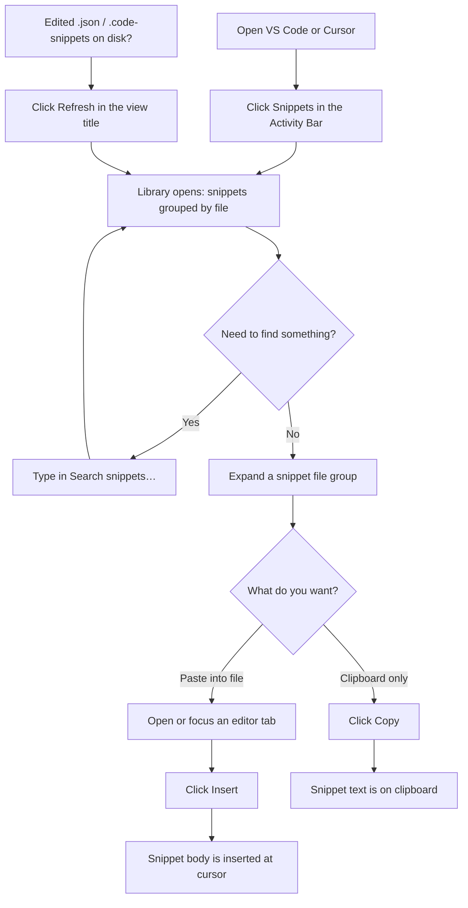
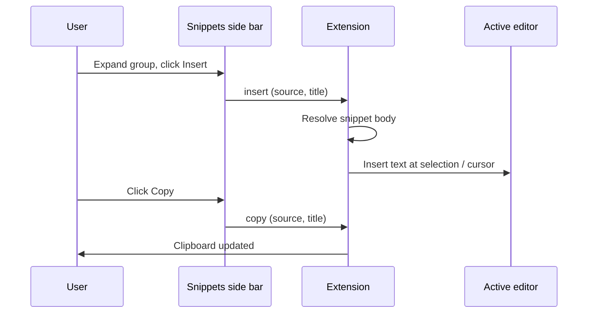

# Step Snippet Library

Browse, search, **insert**, **copy**, **create**, **edit**, and **delete** **your user snippets** from a dedicated side bar. It loads snippet files from **VS Code** and **Cursor** `User/snippets` (`*.json` and `*.code-snippets`), groups them by file, and supports **global** snippets (default `code.code-snippets`) or **language-specific** JSON files.

---

## How it looks in the editor

```
┌──────────────────────────────────────────────────────────────────────────┐
│  [≡] File   Edit   ...                   Step Snippet Library      [- □ ×] │
├───┬────────────────────────────────────────────────────────────────────────┤
│   │                                                                        │
│ S │  ┌─ Library (Snippets) ─────────────────────────────────────────────┐  │
│ n │  │  [ Search snippets…                    ]                          │  │
│ i │  │  ┌─ typescript.json (VS Code) ────────┐                         │  │
│ p │  │  │ ▼ log-to-console                   │                         │  │
│ p │  │  │  [Insert][Copy][Edit][Delete]     │                         │  │
│ e │  │  └────────────────────────────────────┘                         │  │
│ t │  │  ┌─ code.code-snippets (global)                               │  │
│ s │  │  │ ...                                                         │  │
│   │  └────────────────────────────────────────────────────────────────┘  │
│   │                                                                        │
│   │     Your code editor (cursor here when you click Insert)             │
│   │  ┌──────────────────────────────────────────────────────────────┐    │
│   │  │ function example() {                                         │    │
│   │  │   console.log('snippet inserted here');                      │    │
│   │  │ }                                                            │    │
│   │  └──────────────────────────────────────────────────────────────┘    │
└───┴────────────────────────────────────────────────────────────────────────┘
     ▲
     └── Click the "Snippets" icon in the Activity Bar (left strip)
```

---

## User flow (step by step)



---

## Insert vs copy (message flow)



---

## Where snippets are loaded from


Paths follow the usual app data layout for your OS (for example on macOS: `~/Library/Application Support/Code/User/snippets` and `.../Cursor/User/snippets`).

---

## Commands and shortcuts

| Action | How to run |
|--------|------------|
| **Search Snippets** (focus the search box) | Side bar: magnifier in the view title, or Command Palette → “Step Snippet Library: Search Snippets”, or **Ctrl+Alt+S** (Windows/Linux) / **⌘⌥S** (macOS) while the editor has focus |
| **Refresh Snippets** | View title refresh icon, or Command Palette → “Step Snippet Library: Refresh Snippets” |
| **Create Snippet** | Side bar: **+** or Command Palette → “Step Snippet Library: Create Snippet”. Defaults to **`code.code-snippets`** (all languages); use **existing `.json` file** only for a single language; **Title**, **Prefix**, and **Body** are required |
| **Insert / Copy / Edit / Delete** | Library cards: **Insert**, **Copy**, **Edit** (opens form; renames title if you change it), **Delete** (confirmation). Palette insert/copy still expect side bar context. |

---

## Why a snippet shows in the Library but not in the editor

The side bar lists **every** user snippet file. VS Code’s inline suggestions only load snippets that **apply to the current file’s language**:

| Snippet file | When suggestions appear |
|--------------|-------------------------|
| `name.json` | Only when the editor language id is **`name`** (e.g. `typescript.json` → TypeScript). For **Plain Text**, use `plaintext.json`. |
| `*.code-snippets` | Snippets apply broadly; each entry can optionally set `scope` for specific languages. |

So a file like **`debug.json`** is tied to language id **`debug`**, not debugging helpers in general—and **not** to Plain Text. For **global** snippets (Plain Text, TS, Markdown, etc.), use a **`.code-snippets`** file. Create Snippet defaults to **`code.code-snippets`** for that. For **one language only**, add to an existing `typescript.json`-style file instead. You can move/copy entries from `debug.json` into `code.code-snippets`, then reload the window if needed.

---

## Development

```bash
npm install
npm run compile
```

Press **F5** in this workspace to launch an Extension Development Host and try the side bar there.

Package a `.vsix` (uses the script in `package.json`):

```bash
npm run pack
```

---

## Privacy

This extension reads your local user snippet files (VS Code / Cursor `User/snippets`) to populate the Library. It does **not** send snippet content over the network, collect telemetry, or call remote APIs.

---

## Requirements

- VS Code **1.85.0** or compatible (e.g. Cursor).

Enjoy a quicker path from “I know I saved that snippet” to “it’s in my file.”
