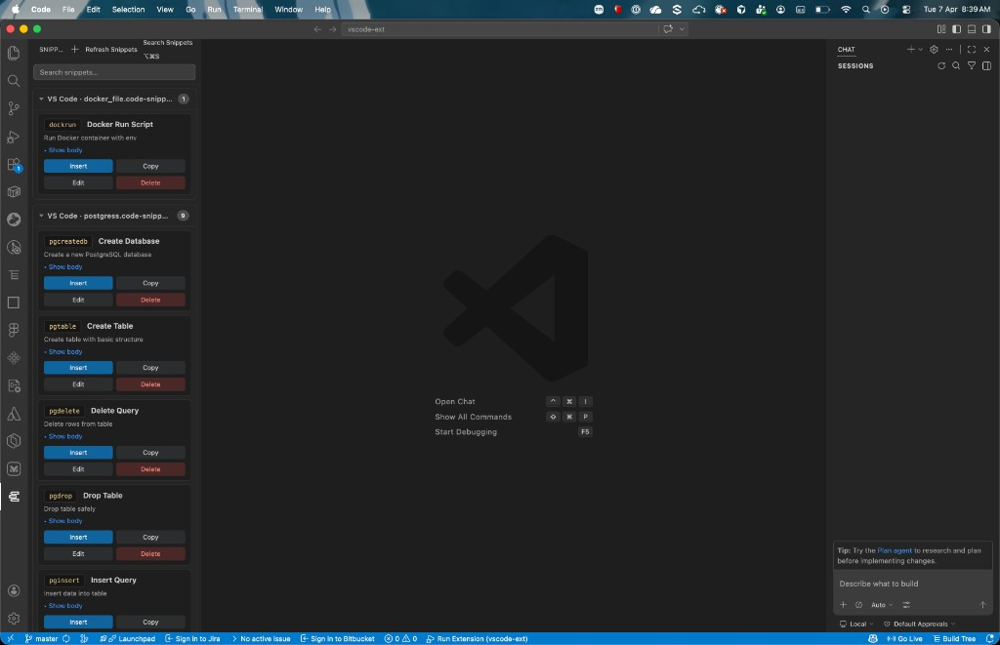
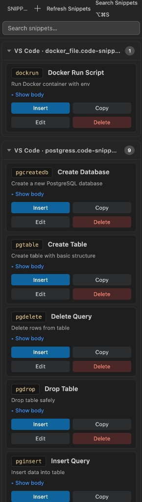

# Snippet Search - Fast Code Snippets

Browse, search, **insert**, **copy**, **create**, **edit**, and **delete** your user snippets from a dedicated side bar. The extension loads snippet files from **VS Code** and **Cursor** `User/snippets` (`*.json` and `*.code-snippets`), groups them by file, and supports **global** snippets (default `code.code-snippets`) or **language-specific** JSON files.

---

## Screenshots

Side bar with snippet groups (e.g. `docker_file.code-snippets`, `postgres.code-snippets`), search, **Refresh**, **Insert / Copy / Edit / Delete** on each card:



Search box, file group headers, prefix badges, descriptions, **Show body**, and action buttons:



Open the **Snippets** icon in the Activity Bar (left) to open the Library.

---

## How snippets are loaded

User snippet files are read from both apps when those folders exist on your machine:

- **VS Code:** e.g. macOS `~/Library/Application Support/Code/User/snippets`
- **Cursor:** e.g. macOS `~/Library/Application Support/Cursor/User/snippets`

The side bar lists every snippet from `*.json` and `*.code-snippets` files in those directories. VS Code’s **inline** snippet suggestions still follow each file’s language rules (see below).

---

## Commands and shortcuts

| Action | How to run |
|--------|------------|
| **Search Snippets** (focus the search box) | Side bar: magnifier in the view title, or Command Palette → **Snippet Search - Fast Code Snippets: Search Snippets**, or **Ctrl+Alt+S** (Windows/Linux) / **⌘⌥S** (macOS) while the editor has focus |
| **Refresh Snippets** | View title refresh icon, or Command Palette → **Snippet Search - Fast Code Snippets: Refresh Snippets** |
| **Create Snippet** | Side bar **+** or Command Palette → **Snippet Search - Fast Code Snippets: Create Snippet**. Defaults to **`code.code-snippets`** (all languages); use an **existing `.json` file** only for a single language. **Title**, **Prefix**, and **Body** are required. |
| **Insert / Copy / Edit / Delete** | On each Library card. **Edit** opens a form (you can rename the title). **Delete** asks for confirmation. |

---

## Why a snippet shows in the Library but not in the editor

The side bar lists **all** user snippets. **Inline suggestions** in the editor only use snippets that **match the current language**:

| Snippet file | When suggestions appear |
|--------------|-------------------------|
| `name.json` | Only when the language mode is **`name`** (e.g. `typescript.json` → TypeScript). For **Plain Text**, use `plaintext.json`. |
| `*.code-snippets` | Typically across languages unless a snippet sets `scope`. |

For **global** snippets, prefer **`code.code-snippets`** (or your own `.code-snippets` file). After editing files on disk, use **Refresh** or reload the window if suggestions look stale.

---

## Development

```bash
npm install
npm run compile
```

Press **F5** to launch an Extension Development Host.

```bash
npm run pack
```

---

## Privacy

This extension reads your local `User/snippets` files only. It does **not** send snippet content over the network or use telemetry.

---

## Requirements

- VS Code **1.85.0** or compatible (e.g. Cursor).
