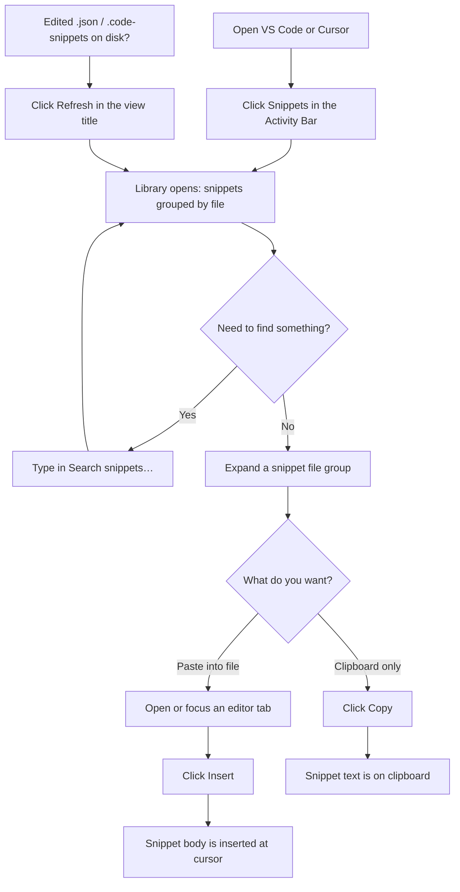
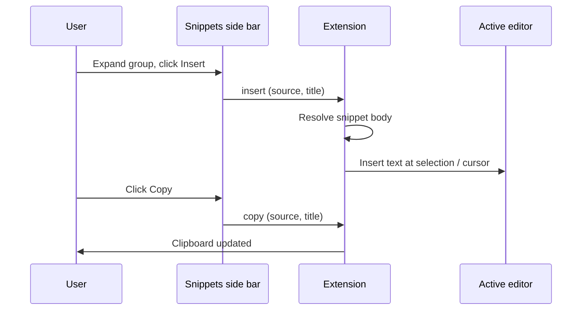
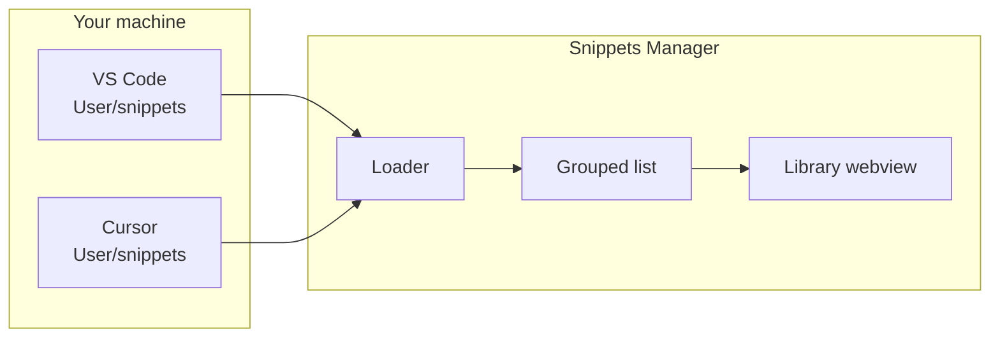

# Snippets Manager

Browse, search, insert, and copy **your user snippets** from a dedicated side bar. The extension loads snippet files from both **VS Code** and **Cursor** user directories (`*.json` and `*.code-snippets`), groups them by file, and lets you drop code into the active editor or the clipboard in a few clicks.

---

## How it looks in the editor

```
┌──────────────────────────────────────────────────────────────────────────┐
│  [≡] File   Edit   ...                        Snippets Manager      [- □ ×] │
├───┬────────────────────────────────────────────────────────────────────────┤
│   │                                                                        │
│ S │  ┌─ Library (Snippets) ─────────────────────────────────────────────┐  │
│ n │  │  [ Search snippets…                    ]                          │  │
│ i │  │  ┌─ typescript.json (VS Code) ────────┐                         │  │
│ p │  │  │ ▼ log-to-console                   │                         │  │
│ p │  │  │    [ Insert ]  [ Copy ]            │                         │  │
│ e │  │  └────────────────────────────────────┘                         │  │
│ t │  │  ┌─ my-snippets.code-snippets (Cursor)                         │  │
│ s │  │  │ ...                                                         │  │
│   │  └────────────────────────────────────────────────────────────────┘  │
│   │                                                                        │
│   │     Your code editor (cursor here when you click Insert)             │
│   │  ┌──────────────────────────────────────────────────────────────┐    │
│   │  │ function example() {                                         │    │
│   │  │   console.log('snippet inserted here');                      │    │
│   │  │ }                                                            │    │
│   │  └──────────────────────────────────────────────────────────────┘    │
└───┴────────────────────────────────────────────────────────────────────────┘
     ▲
     └── Click the "Snippets" icon in the Activity Bar (left strip)
```

---

## User flow (step by step)



---

## Insert vs copy (message flow)



---

## Where snippets are loaded from



Paths follow the usual app data layout for your OS (for example on macOS: `~/Library/Application Support/Code/User/snippets` and `.../Cursor/User/snippets`).

---

## Commands and shortcuts

| Action | How to run |
|--------|------------|
| **Search Snippets** (focus the search box) | Side bar: magnifier in the view title, or Command Palette → “Snippets Manager: Search Snippets”, or **Ctrl+Alt+S** (Windows/Linux) / **⌘⌥S** (macOS) while the editor has focus |
| **Refresh Snippets** | View title refresh icon, or Command Palette → “Snippets Manager: Refresh Snippets” |
| **Insert / Copy** | From the Library only: use the buttons next to each snippet (palette commands expect the side bar context) |

---

## Development

```bash
npm install
npm run compile
```

Press **F5** in this workspace to launch an Extension Development Host and try the side bar there.

Package a `.vsix` (uses the script in `package.json`):

```bash
npm run pack
```

---

## Requirements

- VS Code **1.85.0** or compatible (e.g. Cursor).

Enjoy a quicker path from “I know I saved that snippet” to “it’s in my file.”
